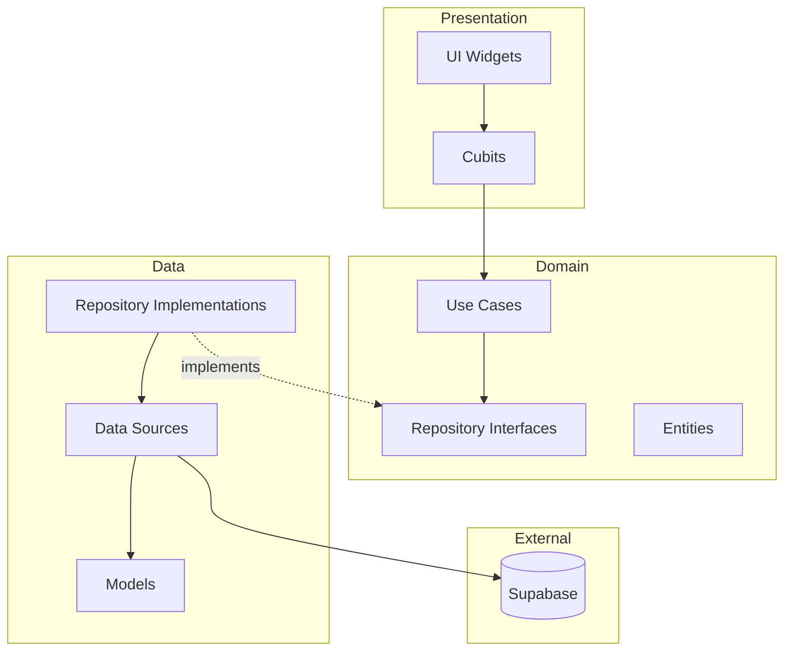

# Design Document

## Overview

تصميم تطبيق E-Commerce متكامل يستخدم Supabase كـ backend مع Clean Architecture و Cubit لإدارة الحالة. التطبيق يدعم نوعين من المستخدمين مع واجهات مختلفة لكل نوع.

## Architecture

### Clean Architecture Layers

```
lib/
├── core/
│   ├── constants/
│   ├── errors/
│   ├── network/
│   ├── routing/
│   ├── theme/
│   └── utils/
├── features/
│   ├── auth/
│   │   ├── data/
│   │   │   ├── datasources/
│   │   │   ├── models/
│   │   │   └── repositories/
│   │   ├── domain/
│   │   │   ├── entities/
│   │   │   ├── repositories/
│   │   │   └── usecases/
│   │   └── presentation/
│   │       ├── cubit/
│   │       └── pages/
│   ├── products/
│   ├── cart/
│   ├── orders/
│   ├── inventory/
│   └── categories/
└── database_scripts/
    ├── 01_create_tables.sql
    ├── 02_rls_policies.sql
    └── 03_functions.sql
```

### Architecture Diagram



## Components and Interfaces

### 1. Supabase Service

```dart
abstract class SupabaseService {
  SupabaseClient get client;
  Future<void> initialize();
}

class SupabaseServiceImpl implements SupabaseService {
  static const String supabaseUrl = 'YOUR_SUPABASE_URL';
  static const String supabaseAnonKey = 'YOUR_SUPABASE_ANON_KEY';
  
  late final SupabaseClient _client;
  
  @override
  SupabaseClient get client => _client;
  
  @override
  Future<void> initialize() async {
    _client = SupabaseClient(supabaseUrl, supabaseAnonKey);
  }
}
```

### 2. Auth Feature

```dart
// Entity
class UserEntity {
  final String id;
  final String email;
  final UserRole role;
  final String? name;
}

enum UserRole { merchant, customer }

// Repository Interface
abstract class AuthRepository {
  Future<Either<Failure, UserEntity>> signIn(String email, String password);
  Future<Either<Failure, UserEntity>> signUp(String email, String password, UserRole role);
  Future<Either<Failure, void>> signOut();
  Future<Either<Failure, UserEntity?>> getCurrentUser();
  Stream<UserEntity?> get authStateChanges;
}

// Cubit States
abstract class AuthState {}
class AuthInitial extends AuthState {}
class AuthLoading extends AuthState {}
class AuthAuthenticated extends AuthState {
  final UserEntity user;
}
class AuthUnauthenticated extends AuthState {}
class AuthError extends AuthState {
  final String message;
}
```

### 3. Products Feature

```dart
// Entity
class ProductEntity {
  final String id;
  final String name;
  final String description;
  final double price;
  final List<String> images;
  final String categoryId;
  final int stock;
  final double rating;
}

// Repository Interface
abstract class ProductRepository {
  Future<Either<Failure, List<ProductEntity>>> getProducts();
  Future<Either<Failure, List<ProductEntity>>> getProductsByCategory(String categoryId);
  Future<Either<Failure, ProductEntity>> getProductById(String id);
  Future<Either<Failure, void>> updateProduct(ProductEntity product);
  Future<Either<Failure, void>> createProduct(ProductEntity product);
  Future<Either<Failure, void>> deleteProduct(String id);
}
```

### 4. Cart Feature

```dart
// Entity
class CartItemEntity {
  final String id;
  final String productId;
  final String userId;
  final int quantity;
  final ProductEntity product;
}

// Repository Interface
abstract class CartRepository {
  Future<Either<Failure, List<CartItemEntity>>> getCartItems(String userId);
  Future<Either<Failure, void>> addToCart(String userId, String productId, int quantity);
  Future<Either<Failure, void>> updateQuantity(String cartItemId, int quantity);
  Future<Either<Failure, void>> removeFromCart(String cartItemId);
  Future<Either<Failure, void>> clearCart(String userId);
  Stream<List<CartItemEntity>> watchCartItems(String userId);
}
```

### 5. Orders Feature

```dart
// Entity
class OrderEntity {
  final String id;
  final String userId;
  final List<OrderItemEntity> items;
  final double total;
  final OrderStatus status;
  final DateTime createdAt;
  final String? customerName;
  final String? deliveryAddress;
}

enum OrderStatus { pending, processing, shipped, delivered, cancelled }

class OrderItemEntity {
  final String productId;
  final String productName;
  final int quantity;
  final double price;
}

// Repository Interface
abstract class OrderRepository {
  Future<Either<Failure, List<OrderEntity>>> getOrders(String userId);
  Future<Either<Failure, List<OrderEntity>>> getAllOrders(); // For merchant
  Future<Either<Failure, OrderEntity>> createOrder(OrderEntity order);
  Future<Either<Failure, void>> updateOrderStatus(String orderId, OrderStatus status);
  Stream<List<OrderEntity>> watchOrders(); // Real-time for merchant
}
```

### 6. Categories Feature

```dart
// Entity
class CategoryEntity {
  final String id;
  final String name;
  final String? imageUrl;
}

// Repository Interface
abstract class CategoryRepository {
  Future<Either<Failure, List<CategoryEntity>>> getCategories();
  Future<Either<Failure, void>> createCategory(CategoryEntity category);
  Future<Either<Failure, void>> updateCategory(CategoryEntity category);
  Future<Either<Failure, void>> deleteCategory(String id);
  Future<Either<Failure, int>> getProductCountByCategory(String categoryId);
}
```

## Data Models

### Supabase Database Schema

```sql
-- Users Profile (extends Supabase Auth)
CREATE TABLE profiles (
  id UUID REFERENCES auth.users PRIMARY KEY,
  email TEXT NOT NULL,
  name TEXT,
  role TEXT NOT NULL CHECK (role IN ('merchant', 'customer')),
  created_at TIMESTAMPTZ DEFAULT NOW()
);

-- Categories
CREATE TABLE categories (
  id UUID PRIMARY KEY DEFAULT gen_random_uuid(),
  name TEXT NOT NULL,
  image_url TEXT,
  created_at TIMESTAMPTZ DEFAULT NOW()
);

-- Products
CREATE TABLE products (
  id UUID PRIMARY KEY DEFAULT gen_random_uuid(),
  name TEXT NOT NULL,
  description TEXT,
  price DECIMAL(10,2) NOT NULL,
  images TEXT[] DEFAULT '{}',
  category_id UUID REFERENCES categories(id),
  stock INTEGER DEFAULT 0,
  rating DECIMAL(2,1) DEFAULT 0,
  created_at TIMESTAMPTZ DEFAULT NOW()
);

-- Cart Items
CREATE TABLE cart_items (
  id UUID PRIMARY KEY DEFAULT gen_random_uuid(),
  user_id UUID REFERENCES profiles(id) ON DELETE CASCADE,
  product_id UUID REFERENCES products(id) ON DELETE CASCADE,
  quantity INTEGER NOT NULL DEFAULT 1,
  created_at TIMESTAMPTZ DEFAULT NOW(),
  UNIQUE(user_id, product_id)
);

-- Orders
CREATE TABLE orders (
  id UUID PRIMARY KEY DEFAULT gen_random_uuid(),
  user_id UUID REFERENCES profiles(id),
  total DECIMAL(10,2) NOT NULL,
  status TEXT DEFAULT 'pending' CHECK (status IN ('pending', 'processing', 'shipped', 'delivered', 'cancelled')),
  delivery_address TEXT,
  created_at TIMESTAMPTZ DEFAULT NOW()
);

-- Order Items
CREATE TABLE order_items (
  id UUID PRIMARY KEY DEFAULT gen_random_uuid(),
  order_id UUID REFERENCES orders(id) ON DELETE CASCADE,
  product_id UUID REFERENCES products(id),
  product_name TEXT NOT NULL,
  quantity INTEGER NOT NULL,
  price DECIMAL(10,2) NOT NULL
);
```

### Flutter Models

```dart
class ProductModel extends ProductEntity {
  ProductModel({
    required super.id,
    required super.name,
    required super.description,
    required super.price,
    required super.images,
    required super.categoryId,
    required super.stock,
    required super.rating,
  });

  factory ProductModel.fromJson(Map<String, dynamic> json) {
    return ProductModel(
      id: json['id'],
      name: json['name'],
      description: json['description'] ?? '',
      price: (json['price'] as num).toDouble(),
      images: List<String>.from(json['images'] ?? []),
      categoryId: json['category_id'],
      stock: json['stock'] ?? 0,
      rating: (json['rating'] as num?)?.toDouble() ?? 0.0,
    );
  }

  Map<String, dynamic> toJson() {
    return {
      'id': id,
      'name': name,
      'description': description,
      'price': price,
      'images': images,
      'category_id': categoryId,
      'stock': stock,
      'rating': rating,
    };
  }
}
```


## Correctness Properties

*A property is a characteristic or behavior that should hold true across all valid executions of a system-essentially, a formal statement about what the system should do. Properties serve as the bridge between human-readable specifications and machine-verifiable correctness guarantees.*

### Property 1: Role-based Registration Consistency
*For any* valid registration with email, password, and role, the created user profile in Supabase SHALL have the same role that was specified during registration.
**Validates: Requirements 1.2**

### Property 2: Role-based Dashboard Routing
*For any* authenticated user, the dashboard displayed SHALL match the user's role (merchant dashboard for merchants, customer home for customers).
**Validates: Requirements 1.3, 1.5**

### Property 3: Session Lifecycle
*For any* user who logs out, the session SHALL be cleared and subsequent app opens SHALL show the login screen until re-authentication.
**Validates: Requirements 1.6**

### Property 4: Category Filtering Correctness
*For any* category selection, all displayed products SHALL belong to the selected category (product.categoryId equals selected categoryId).
**Validates: Requirements 2.2**

### Property 5: Cart Total Calculation
*For any* cart state, the displayed total SHALL equal the sum of (item.price × item.quantity) for all items in the cart.
**Validates: Requirements 3.2, 3.4**

### Property 6: Cart Item Removal on Zero Quantity
*For any* cart item whose quantity is decreased to zero, the item SHALL be removed from both local state and Supabase.
**Validates: Requirements 3.3**

### Property 7: Cart-Database Sync
*For any* cart modification (add, update, remove), the local cart state SHALL match the Supabase cart_items table for that user.
**Validates: Requirements 3.1, 3.5**

### Property 8: Order Creation Stock Decrement
*For any* order created, the stock of each ordered product SHALL decrease by exactly the ordered quantity.
**Validates: Requirements 4.2**

### Property 9: Order Creation Cart Clearing
*For any* successful order creation, the customer's cart SHALL be empty after the operation completes.
**Validates: Requirements 4.3**

### Property 10: Order Status Persistence
*For any* order status update by a merchant, the new status SHALL be persisted in Supabase and reflected in subsequent fetches.
**Validates: Requirements 5.3**

### Property 11: Inventory Stock Update Persistence
*For any* stock quantity update by a merchant, the new quantity SHALL be persisted in Supabase and reflected in subsequent fetches.
**Validates: Requirements 6.2**

### Property 12: Out of Stock Marking
*For any* product whose stock reaches zero, the product SHALL be marked as "out of stock" in the system.
**Validates: Requirements 6.3**

### Property 13: Category Deletion Protection
*For any* category that has associated products, deletion attempts SHALL fail and the category SHALL remain in the database.
**Validates: Requirements 7.5**

### Property 14: Product Model Serialization Round-Trip
*For any* valid ProductModel, serializing to JSON then deserializing SHALL produce an equivalent ProductModel.
**Validates: Requirements 2.3, 6.4**

## Error Handling

### Error Types

```dart
abstract class Failure {
  final String message;
  const Failure(this.message);
}

class ServerFailure extends Failure {
  const ServerFailure(super.message);
}

class AuthFailure extends Failure {
  const AuthFailure(super.message);
}

class CacheFailure extends Failure {
  const CacheFailure(super.message);
}

class ValidationFailure extends Failure {
  const ValidationFailure(super.message);
}
```

### Error Handling Strategy

1. **Network Errors**: Catch Supabase exceptions and convert to ServerFailure
2. **Auth Errors**: Handle Supabase Auth exceptions with specific messages
3. **Validation Errors**: Validate input before API calls
4. **State Errors**: Emit error states from Cubits for UI to display

## Testing Strategy

### Property-Based Testing Library
- **Library**: `fast_check` for Dart property-based testing
- **Minimum iterations**: 100 per property test

### Unit Tests
- Test individual use cases with mocked repositories
- Test Cubit state transitions
- Test model serialization/deserialization

### Property-Based Tests
Each correctness property will have a corresponding property-based test:

```dart
// Example: Property 5 - Cart Total Calculation
// **Feature: ecommerce-supabase-integration, Property 5: Cart Total Calculation**
test('cart total equals sum of item prices times quantities', () {
  fc.assert(
    fc.property(
      fc.list(cartItemArbitrary),
      (items) {
        final calculatedTotal = items.fold<double>(
          0, (sum, item) => sum + (item.price * item.quantity)
        );
        final cartTotal = calculateCartTotal(items);
        return (cartTotal - calculatedTotal).abs() < 0.01;
      },
    ),
    numRuns: 100,
  );
});
```

### Integration Tests
- Test Supabase data source with real database (test environment)
- Test real-time subscriptions
- Test authentication flow end-to-end

### Test File Structure
```
test/
├── features/
│   ├── auth/
│   │   ├── data/
│   │   │   └── repositories/auth_repository_impl_test.dart
│   │   ├── domain/
│   │   │   └── usecases/
│   │   └── presentation/
│   │       └── cubit/auth_cubit_test.dart
│   ├── products/
│   ├── cart/
│   ├── orders/
│   └── categories/
└── property_tests/
    ├── cart_properties_test.dart
    ├── order_properties_test.dart
    └── inventory_properties_test.dart
```
