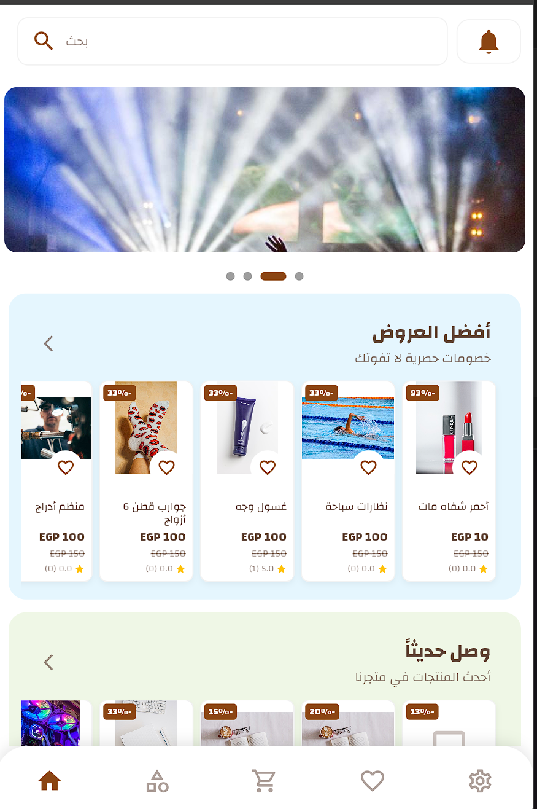
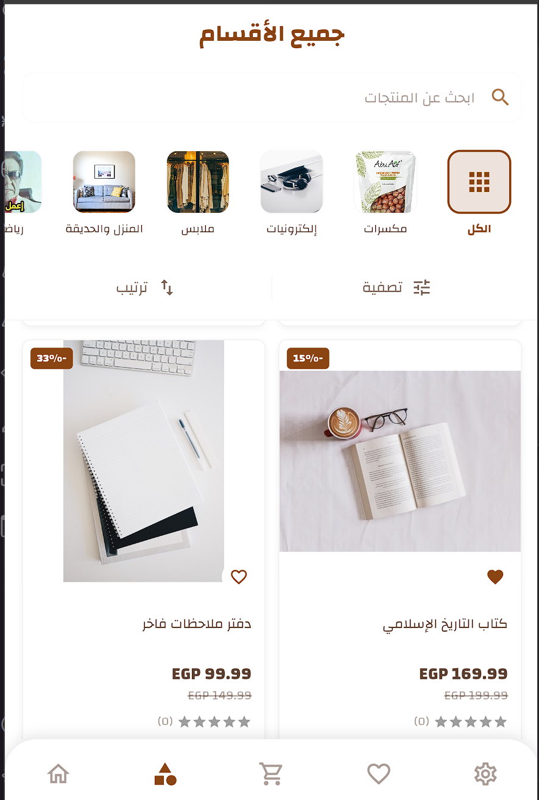
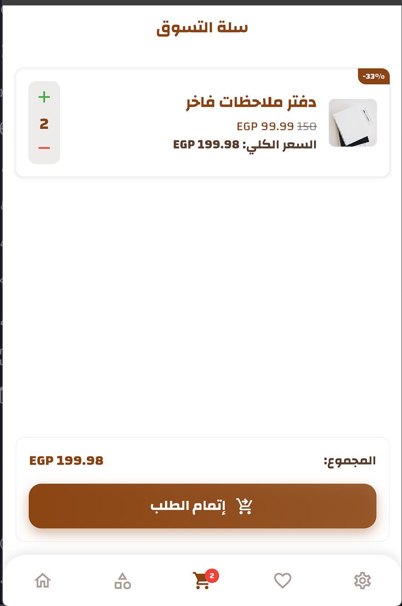
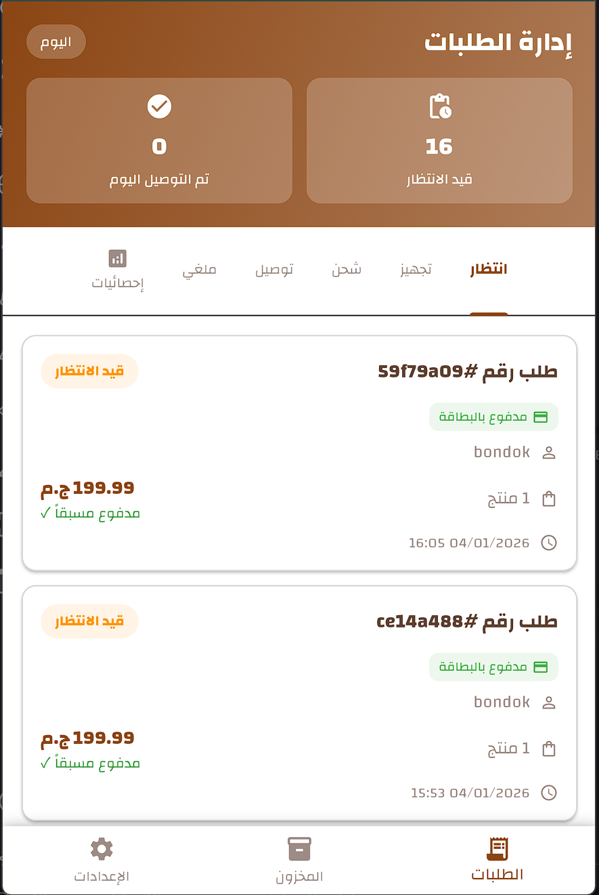
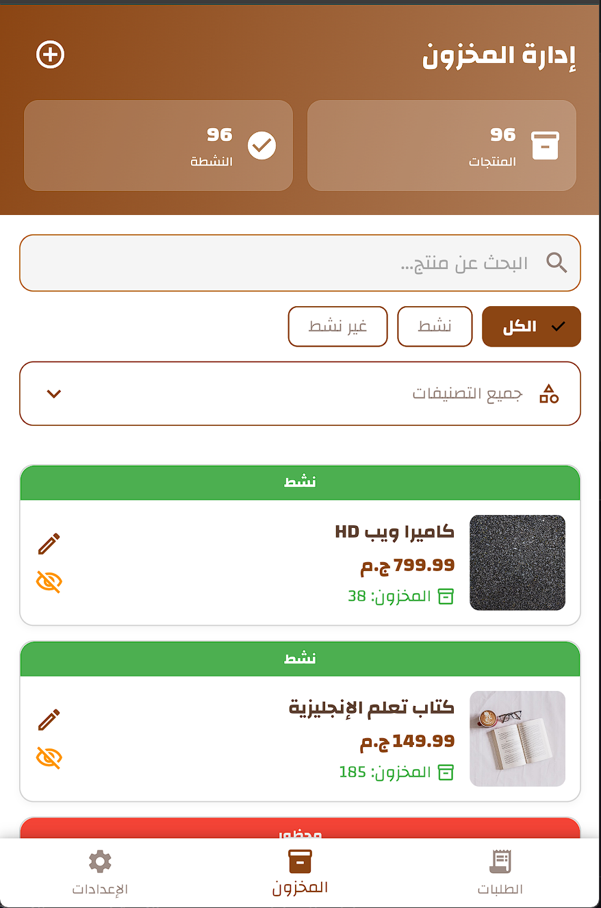
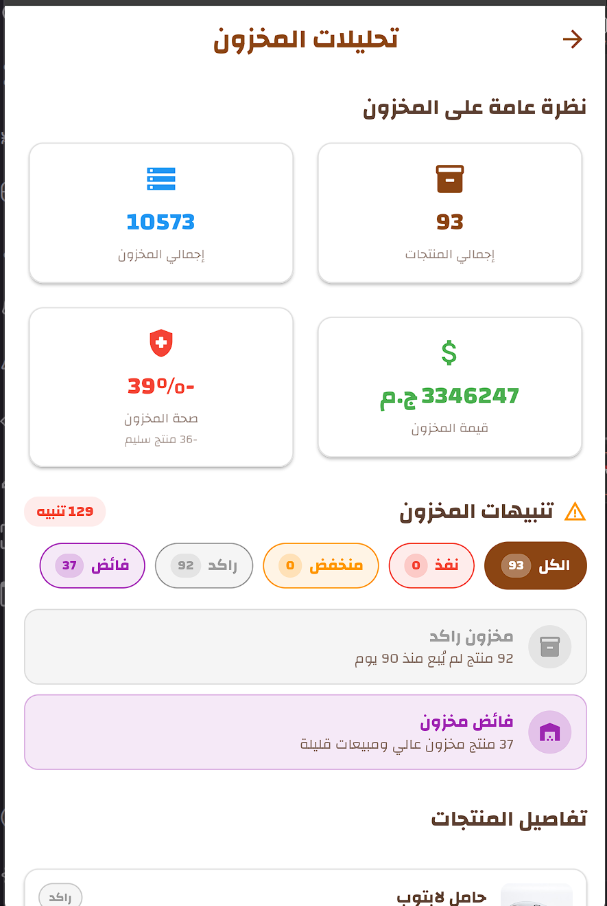
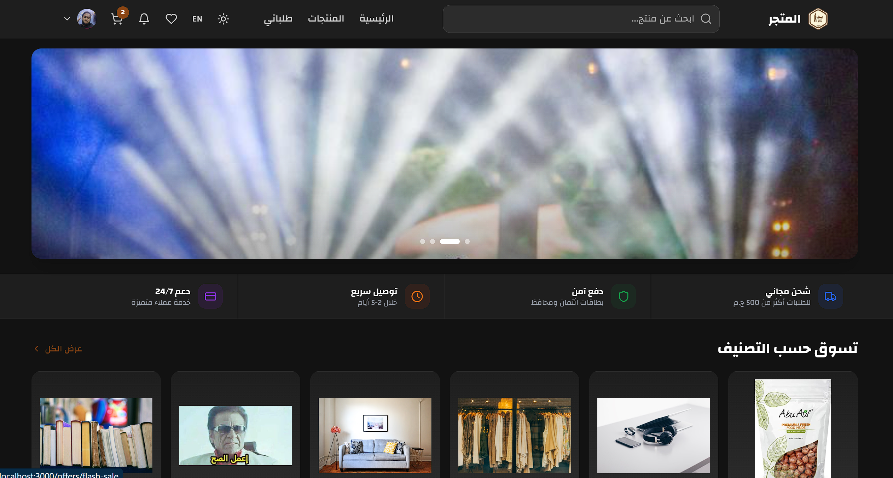
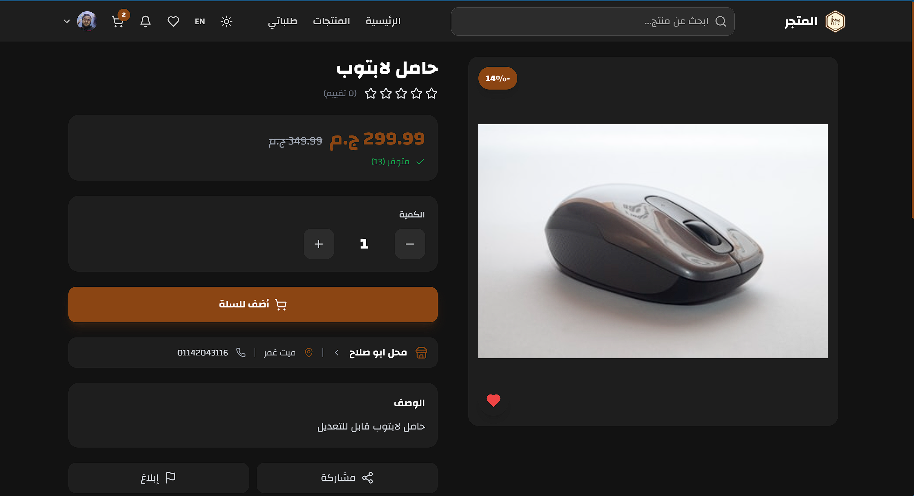
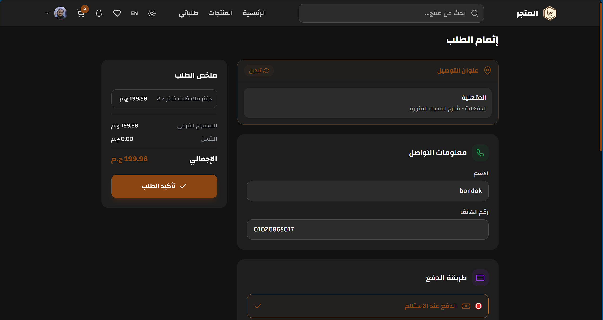

<div align="center">

# Zahret Al-Tamoor E-Commerce Platform

### A premium bilingual shopping experience for customers, merchants, and administrators.


</div>

---

## Overview

Zahret Al-Tamoor is a complete e-commerce ecosystem built for modern online retail. It combines a polished Flutter mobile application with a responsive Next.js web storefront, giving customers a smooth shopping journey while giving merchants and admins the tools they need to manage products, orders, coupons, inventory, reports, payments, and customer activity.

The platform supports Arabic and English interfaces, right-to-left layouts, merchant dashboards, product discovery, cart and checkout flows, order tracking, inventory analytics, banners, coupons, reviews, reports, and Paymob payment integration.

## Product Highlights

- Premium mobile shopping app with home banners, categories, product cards, favorites, cart, checkout, and profile settings.
- Merchant tools for product management, order management, stock control, low-stock alerts, and inventory value insights.
- Admin experience for users, products, orders, coupons, banners, reports, shipping, and store governance.
- Web storefront with a luxurious dark theme, responsive product browsing, product details, and checkout.
- Supabase backend with authentication, database tables, storage, row-level security, and serverless functions.
- Payment support for cash on delivery, card payment, and e-wallet flows through Paymob.
- Bilingual Arabic and English localization with RTL-first UX support.

## Screenshots

### Mobile Experience

| Home | Categories |
| --- | --- |
|  |  |

| Product Details | Cart |
| --- | --- |
|  |  |

### Merchant and Inventory

| Orders Dashboard | Inventory Manager | Inventory Analytics |
| --- | --- | --- |
|  |  |  |

### Web Storefront

| Web Home |
| --- |
|  |

| Product Details | Checkout |
| --- | --- |
|  |  |

## Core Modules

- Customer App: onboarding, authentication, home feed, search, filters, product details, cart, checkout, orders, favorites, reviews, reports, notifications, settings, and addresses.
- Merchant Dashboard: store setup, product CRUD, category management, merchant orders, coupons, shipping prices, stock alerts, inventory analytics, and review handling.
- Admin Dashboard: global overview, product moderation, user management, order monitoring, coupon control, banner management, reports, charts, and platform settings.
- Web Store: Next.js storefront with dark mode, product browsing, product pages, cart, checkout, payment callbacks, and SEO-friendly routing.
- Backend: Supabase database scripts, storage buckets, RLS policies, edge functions, and Paymob webhook/payment functions.

## Tech Stack

| Layer | Technologies |
| --- | --- |
| Mobile | Flutter, Dart, BLoC, GoRouter, Easy Localization |
| Web | Next.js 14, React, Tailwind CSS, Framer Motion, MUI |
| Backend | Supabase Auth, PostgreSQL, Storage, Edge Functions |
| Payments | Paymob card, wallet, webhook, and callback flows |
| UX | Arabic/English localization, RTL layouts, dark web theme, cached images, skeleton loading |
| Analytics | Admin charts, reports, inventory insights, order statistics |

## Project Structure

```text
.
|-- lib/                    # Flutter mobile application
|   |-- core/               # Routing, services, constants, shared widgets
|   `-- features/           # Auth, home, products, cart, orders, merchant, admin, payment
|-- webapp/                 # Next.js web storefront
|   |-- src/app/            # App Router pages and API routes
|   |-- src/features/       # Web feature modules
|   `-- src/shared/         # Shared hooks, services, components, contexts
|-- database_scripts/       # Supabase schema, policies, functions, seed scripts
|-- supabase/functions/     # Paymob Edge Functions
|-- assets/                 # App assets and translations
`-- docs/screenshots/       # README screenshots
```

## Getting Started

### Mobile App

```bash
flutter pub get
flutter run
```

### Web Storefront

```bash
cd webapp
npm install
npm run dev
```

### Supabase

Run the SQL files inside `database_scripts/` in order, then configure the Supabase project URL, anon key, storage buckets, RLS policies, and Paymob functions according to your deployment environment.

## Configuration Notes

- Flutter assets and translations are registered in `pubspec.yaml`.
- English and Arabic translation files live in `assets/translations/`.
- The Next.js storefront lives in `webapp/`.
- Paymob API routes and callbacks are available in `webapp/src/app/api/paymob/`.
- Supabase Edge Functions are available in `supabase/functions/`.

## Experience

This project is designed to feel polished, fast, and commercially ready: customers get a refined shopping flow, merchants get operational control, and admins get visibility across the whole marketplace.

<div align="center">

### Built for elegant commerce, reliable operations, and scalable growth.

</div>
